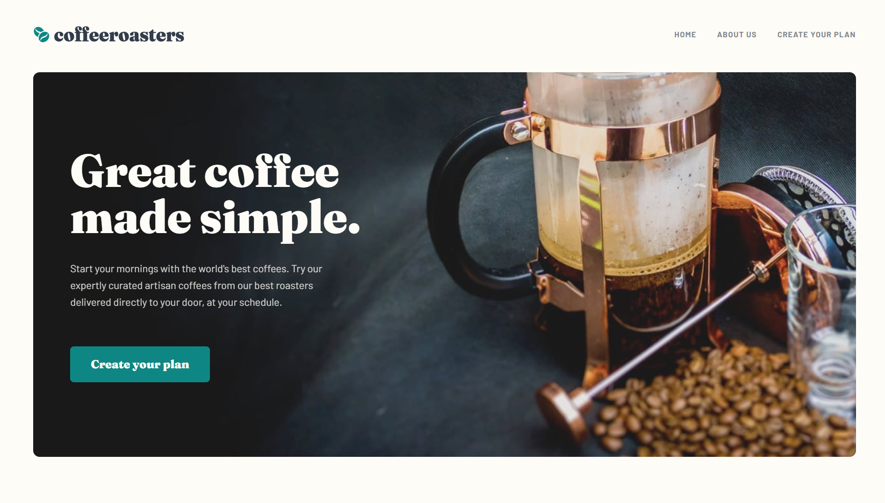
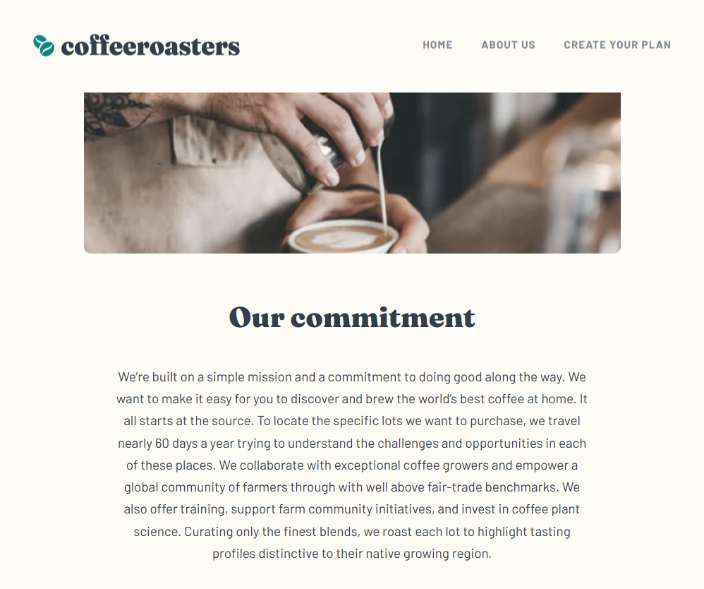
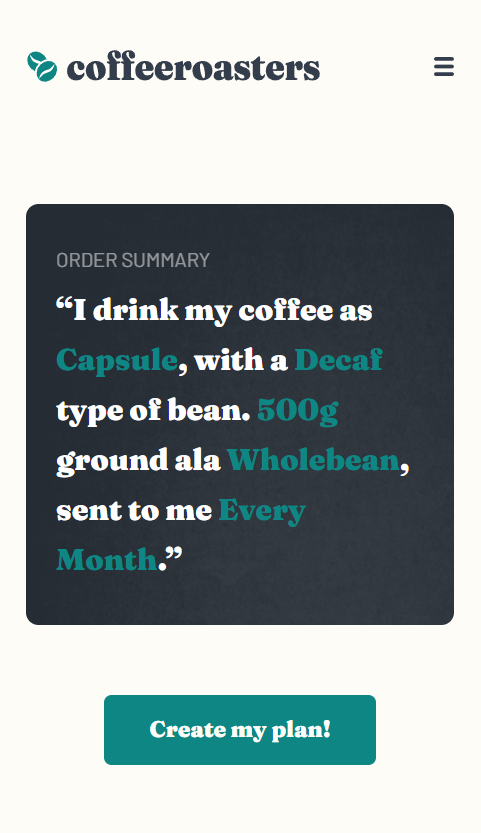

# Frontend Mentor - Coffeeroasters subscription site solution

Це рішення для [завдання “Coffeeroasters subscription site” на Frontend Mentor](https://www.frontendmentor.io/challenges/coffeeroasters-subscription-site-5Fc26HVY6). Завдання Frontend Mentor допомагають удосконалити навички програмування шляхом створення реалістичних проєктів.

## Зміст

- [Огляд](#overview)
  - [Завдання](#the-challenge)
  - [Знімок екрана](#screenshot)
  - [Посилання](#links)
  - [Створено з використанням](#built-with)
  - [Чому я навчився](#what-i-learned)
  - [Подальший розвиток](#continued-development)
- [Автор](#author)
- [Подяки](#acknowledgments)


## Огляд

Цей проєкт зайняв у мене приблизно 10 днів, по 2-3 години роботи щоденно. Я додав кілька невеликих деталей: липке позиціонування хедера з функцією приховування при скролі вниз і показом при скролі вгору, а також зручний функціонал форми з можливістю автоматичного переходу до наступного питання та відслідковуванням прогресу.

### Завдання

Користувачі повинні мати змогу:
- Переглядати оптимальне розташування елементів на кожній сторінці залежно від розміру екрану їхнього пристрою
- Побачити ефекти при наведенні на всі інтерактивні елементи на сайті
- Робити вибір для створення підписки на каву та переглядати модальне вікно з підсумком замовлення їхніх виборів

### Screenshot





### Посилання

- URL рішення: [https://github.com/des0lt/cofeeroasters](https://github.com/des0lt/cofeeroasters)
- URL робочого сайту: [https://des0lt.github.io/cofeeroasters/](https://des0lt.github.io/cofeeroasters/)

### Створено за допомогою

- Семантичної розмітки HTML5
- Кастомних CSS властивостей
- Flexbox
- JavaScript
- CSS вкладень
- JS модулів

### Чому я навчився

*У цьому проекті я навчився:*
1. Брати певні дані з data-атрибутів та використовувати їх:

```html
    <div class="form-option price-selector">
        <label class="animated">
            <input type="radio" name="deliver" value="Every Week" />
            <div class="card-content">
                <h4 class="fraunces-h4">Every week</h4>
                <p class="barlow-body-text">$7.20 per shipment. Includes free first-class shipping.</p>
            </div>
        </label>

        <!-- Інші елементи -->

    </div>
```

```js
    let priceSelector = document.querySelector('.price-selector label input:checked').value;
    let price = ''
    switch (priceSelector) {
        case 'Every Week':
            price = `7.20`
            break;
        case 'Every 2 Weeks':
            price = `9.60`
            break;
        case 'Every Month':
            price = `12.00`
            break;
        default:
            price = `-`
    }
```

2. Використовувати CSS-функцію, завдяки якій розмір шрифту динамічно змінюється залежно від ширини екрану, при цьому маючи певні обмеження:

```css
    .fraunces-title-alternate-big-text {
        font-size: clamp(1px, 15vw, 240px);
    }
```

3. Ітерувати по елементах, ставлячи атрибут `data-num` з номером (0, 1, 2, ...). Далі цей `data-num` використовувати для синхронізації станів (активний/неактивний) між різними частинами інтерфейсу та для навігації:

```js
    dataNumAdd(formOptionWrap);
    dataNumAdd(planFormMenuBtn);

    function dataNumAdd(elements) {
        elements.forEach((element, i) => {
            element.dataset.num = i;
        })
    }

    formOptionWrapBtn.forEach((element, i) => {
        element.addEventListener('click', () => {
            element.parentElement.classList.toggle('active');
            swithDataClass(planFormMenuBtn, element.closest('.form-option-wrap').dataset.num);
        });
    });
```

### Подальший розвиток

Цей проєкт не викликав складнощів та був дуже приємним у розробці завдяки вдалому дизайну та зрозумілій структурі. Все виходило так, як я планував, що приносило мені справжнє задоволення. У майбутньому хотів би працювати над подібними проєктами з цікавими викликами та нестандартними рішеннями.

## Author

- GitHub - [Роман Ткаченко (des0lt)](https://github.com/des0lt)

## Подяки

Я б хотів віддячити свого ментора [Івана](https://learningtogetherua.github.io/courses/#fullcourse) за надання та допомогу з цим проєктом. На мої запитання він давав мені пояснення та корисні ресурси, щоб я ознайомився з вирішенням цих проблем.
